<style>body {text-align: justify}</style>
<sub>Attribuzione immagine[^1]</sub>
[^1]:Image designed by [Freepik](http://www.freepik.com)

In questa guida vedremo come installare e configurare alcuni strumenti necessari per lo sviluppo software. Alcuni strumenti non sono strettamente necessari, altri invece sono indispensabili per le attività di laboratorio. In particolare, vedremo:

* La differenza tra il Command Prompt (CMD), Windows PowerShell e PowerShell
* il comando winget per l’installazione e l’aggiornamento degli applicativi di Windows.
* Installazione di Windows Terminal (se non già presente). Non essenziale, ma utile.
* Installazione di Powershell (diversa da Windows PowerShell).
* Abilitare Windows Sandbox. Non essenziale, ma utile in alcuni contesti
* La personalizzazione di PowerShell mediante OhMyPosh. Non essenziale, ma interessante per coloro che vogliono una personalizzazione accattivante del proprio terminale.
* Installazione di Git. Fondamentale per qualunque sviluppatore di codice.
* Installazione di Visual Studio Community 2022 con i workload necessari per lo sviluppo di ASP.NET Core e di .NET MAUI. Importante per gli argomenti sviluppati durante il corso
<!--more-->

## Il Command Prompt (CMD)

[Il prompt dei comandi CMD](https://it.wikipedia.org/wiki/Cmd.exe) è l\'interfaccia a riga di comando fornita da Microsoft a partire da Windows NT (a partire dal 1993). L'interfaccia è richiamabile digitando CMD oppure Command Prompt dalla barra di ricerca globale di Windows. Può essere lanciata co me utente normale, oppure come amministratore:

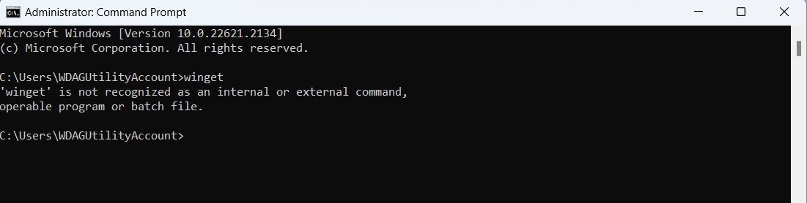

I comandi del CMD sono richiamabili inviando il comando HELP. Per ottenere una descrizione dettagliata dei comandi si può scrivere help command-name. Una descrizione dei comandi del CMD si trova anche all'indirizzo: <https://ss64.com/nt/>

## Windows PowerShell

[Windows PowerShell](https://it.wikipedia.org/wiki/PowerShell) è una shell basata su .NET Framework, introdotta dal 2006, con una serie di comandi che permettono di automatizzare attività e ad eseguire alcune operazioni di sistema che non possono essere fatte con il classico CMD. Ad esempio, gli amministratori di sistema, possono utilizzare script di Windows PowerShell per la gestione di Active Directory. Le caratteristiche di Windows Powershell sono descritte nella [documentazione Microsoft](https://learn.microsoft.com/en-us/powershell/scripting/windows-powershell/starting-windows-powershell):

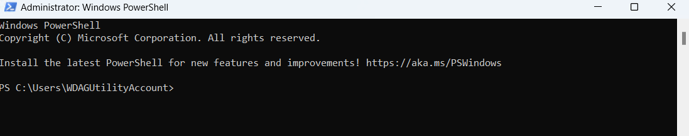

## PowerShell

[PowerShell](https://learn.microsoft.com/en-us/powershell) è
l'evoluzione di Windows PowerShell, anche se su Windows è possibile avere installate sia Windows PowerShell che PowerShell. PowerShell è basata su .NET Core ed è un progetto Open Source introdotto con PowerShell 6. Nella [documentazione Microsoft](https://learn.microsoft.com/en-us/powershell/scripting/whats-new/differences-from-windows-powershell) viene evidenziata la differenza tra Windows PowerShell e PowerShell:

"*Windows PowerShell 5.1 is built on top of the .NET Framework v4.5. With the release of PowerShell 6.0, PowerShell became an open source project built on .NET Core 2.0. Moving from the .NET Framework to .NET Core allowed PowerShell to become a cross-platform solution. PowerShell runs on Windows, macOS, and Linux.*

*There are few differences in the PowerShell language between Windows PowerShell and PowerShell. The most notable differences are in the availability and behavior of PowerShell cmdlets between Windows and non-Windows platforms and the changes that stem from the differences between the .NET Framework and .NET Core*."

L'installazione di PowerShell puo essere fatta utilizzando uno dei modi descritti nella [documentazione Microsoft](https://learn.microsoft.com/en-us/powershell/scripting/install/installing-powershell-on-windows), ed in particolare, usando il comando winget (vedi sotto).

## Windows Package Manager

*"[Windows Package Manager](https://learn.microsoft.com/en-us/windows/package-manager/) is a comprehensive package manager solution that consists of a command line tool and set of services for installing applications on Windows 10 and Windows 11. Developers use the winget command line tool to discover, install, upgrade, remove and configure a curated set of applications. After it is installed, developers can access winget via the Windows Terminal, PowerShell, or the Command Prompt"*.

### Il command-line winget

[winget](https://learn.microsoft.com/en-us/windows/package-manager/winget/)
è uno strumento da riga di comando che permette di installare, aggiornare, rimuovere applicazioni per Windows, eseguendo direttamente uno script da riga di comando. L'esperienza d'uso per l'utente è, per certi versi, simile a quella di alcuni packet manager di distribuzioni Linux (`apt-get` ad esempio).

Il command-line tool winget è disponile a partire da alcune versioni recenti di Windows 10 e in tutte le versioni di Windows 11 come parte dell'App installer.

Normalmente winget è già installato su Windows, ma nel caso non lo fosse, si può trovare il dettaglio su come installare winget nella [documentazione Microsoft](https://learn.microsoft.com/en-us/windows/package-manager/winget/#install-winget).

Ad esempio, per installare un'applicazione con winget, il flusso di lavoro procede con un comando search per trovare l'applicazione che si vuole installare, seguito da un comando install con l'Id dell'app da installare.

Supponendo di voler installare il pacchetto Microsoft PowerToys:

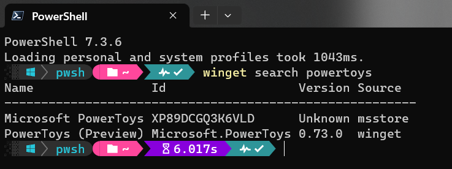

Il comando per installare la versione corretta del programma è:

```ps1
winget install Microsoft.PowerToys
```

Per installare l'ultima versione di PowerShell il modo più semplice è quello di eseguire il comando:

```ps1
winget install --id Microsoft.Powershell --source winget
```

Per verificare l'elenco dei programmi aggiornabili con winget basta digitare

```ps1
winget upgrade
```

Per aggiornare un programma specifico basta eseguire il comando

```ps1
winget upgrade packageId
```

Per aggiornare tutte le applicazioni gestite da winget è possibile lanciare un comando come il seguente, in una shell con privilegi di amministratore:

```ps1
winget upgrade --all --force --silent
```

**Nota**: per installare winget in una Windows Sandbox, procedere comedescritto nella [documentazione Microsoft specifica](https://learn.microsoft.com/en-us/windows/package-manager/winget/#install-winget-on-windows-sandbox).

## Windows Terminal

[Windows Terminal](https://learn.microsoft.com/en-us/windows/terminal/) è un terminale evoluto presente nelle versioni più recenti di Windows.

"*Windows Terminal is a modern host application for the command-line shells you already love, like Command Prompt, PowerShell, and bash (via Windows Subsystem for Linux (WSL)). Its main features include multiple tabs, panes, Unicode and UTF-8 character support, a GPU accelerated text rendering engine, and the ability to create your own themes and customize text, colors, backgrounds, and shortcuts*."

L'[installazione di Windows Terminal](https://learn.microsoft.com/en-us/windows/terminal/install) si può fare a partire dal Microsoft Sore (se presente sul proprio sistema), oppure utilizzando altri modi alternativi, ad esempio winget, come descritto nella [documentazione di Windows Terminal su GitHub](https://github.com/microsoft/terminal#via-windows-package-manager-cli-aka-winget):

```ps1
winget install --id Microsoft.WindowsTerminal -e
```

## Windows SandBox

*[Windows Sandbox](https://learn.microsoft.com/en-us/windows/security/application-security/application-isolation/windows-sandbox/windows-sandbox-overview) provides a lightweight desktop environment to safely run applications in isolation. Software installed inside the Windows Sandbox environment remains \"sandboxed\" and runs separately from the host machine*.

Per installare Windows Sandbox occorre:

* *"Windows 10 Pro or Enterprise, build version 18305 or Windows 11* (non funziona su Windows Home)

* *Enable virtualization on the machine*

* *Use the search bar on the task bar and type Turn Windows Features on
    or off to access the Windows Optional Features tool. Select Windows
    Sandbox and then OK. Restart the computer if you\'re prompted."*

Per i dettagli sull'installazione di Windows SandBox si rimanda alla [documentazione Microsoft](https://learn.microsoft.com/en-us/windows/security/application-security/application-isolation/windows-sandbox/windows-sandbox-overview#installation).

## OhMyPosh, la shell con stile

[OhMyPosh](https://ohmyposh.dev/) è una utility che permette un elevato grado di personalizzazione della propria shell (sia per Windows che per Linux).

L'installazione di OhMyPosh si può fare seguendo la documentazione ufficiale, oppure seguendo gli ottimi tutorial di Scott Hanselman, in particolare quello intitolato "[My Ultimate PowerShell prompt with Oh My Posh and the Windows Terminal](https://www.hanselman.com/blog/my-ultimate-powershell-prompt-with-oh-my-posh-and-the-windows-terminal)" e quello intitolato "[Adding Predictive IntelliSense to my Windows Terminal PowerShell Prompt with PSReadline](https://www.hanselman.com/blog/adding-predictive-intellisense-to-my-windows-terminal-powershell-prompt-with-psreadline)".
Nel primo viene mostrata, passo passo la procedura per installare e configurare OhMyPosh; nel secondo viene abilitata una funzione di predizione della shel che suggerisce il completamento dei comandi. La personalizzazione della console passa anche attraverso l'adozione di font particolari come [Nerd Fonts](https://www.nerdfonts.com/font-downloads).

## Installazione di Visual Studio Code

Visual Studio Code è un ottimo editor di testo, che grazie alla miriade di plugin disponibili, si può trasformare in un IDE completo per tantissimi linguaggi di programmazione. Visual Studio Code può essere scaricato gratuitamente dal link: <https://code.visualstudio.com/download>. Visual Studio Code, oltre che essere uno degli IDE più usati in assoluto per sviluppare applicazioni web, può essere usato anche per programmare in ambiente .NET e come editor di testo integrato in Git (vedi sotto). L'installazione di Visual Studio Code è molto semplice e non richiede particolari accorgimenti, tuttavia si consiglia di accettare le impostazioni che consentono di aggiungere al menù contestuale del File Explorer la possibilità di aprire un file e una cortella con Visual Studio Code.

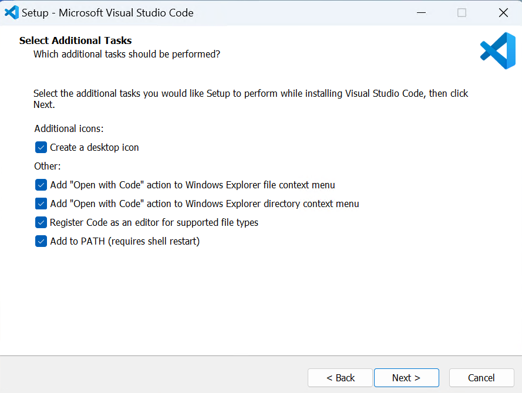

## Installazione di Git

*Git is a free and open source distributed version control system designed to handle everything from small to very large projects with speed and efficiency.*
Il sito ufficiale di Git è <https://git-scm.com/>.

Per installare Git su Windows si può utilizzare il comando winget:

```ps1
winget install --id Git.Git -e --source winget
```

Tuttavia, l'installazione eseguta tramite winget installa Git con le impostazioni di default, senza dare la possibilità all'utente di scegliere tra le varie opzioni disponibili. Questa opzione è indicata per utenti esperti che successivamente sanno modificare le impostazioni di funzionamento di Git con i comandi opportuni.

Per utenti principianti è più opprtuno usare l'installer per Windows, scaricabile da <https://git-scm.com/download/win>, oppure da <https://gitforwindows.org/> e seguire i passaggi richiesti dell'installer. In particolare, è utile soffermarsi su alcuni punti dell'installazione per essere sicuri di aver configurato Git nel modo più utile per un utente inesperto su Windows:

1. Scaricare l'installer di Git for Windows a 64 bit
2. Far partire l'installer accettando le condizioni di default, ma selezionare anche i componenti opzionali per Windows.

    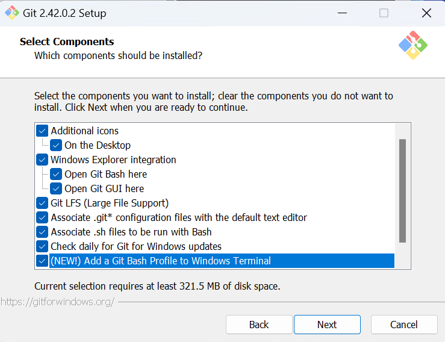

3. Proseguire nell'installazione e, arrivati al punto in cui l'installer chiede di scegliere il default editor, selezionare Visual Studio Code.

    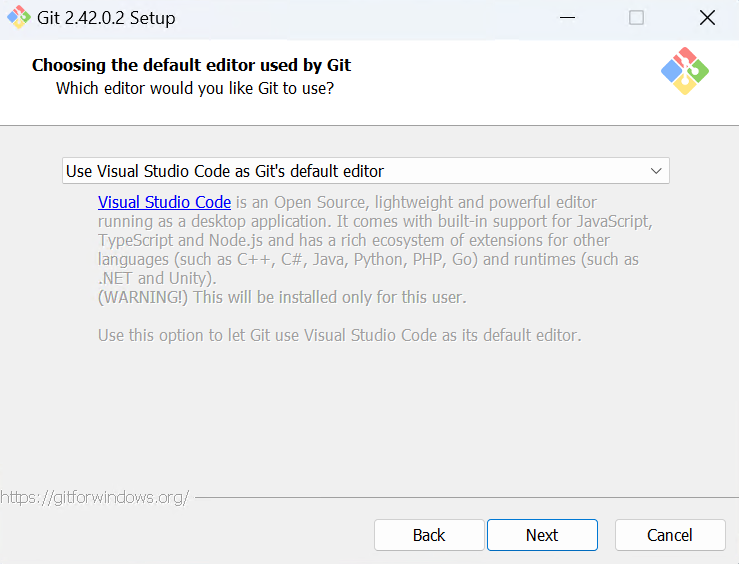

4. Impostare `main` come nome di default del branch principale per i nuovi repository

    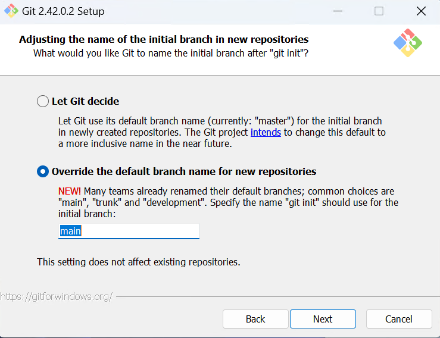

5. Impostare il path in modo che Git sia richiamabile dalla command line e anche da software di terze parti 

    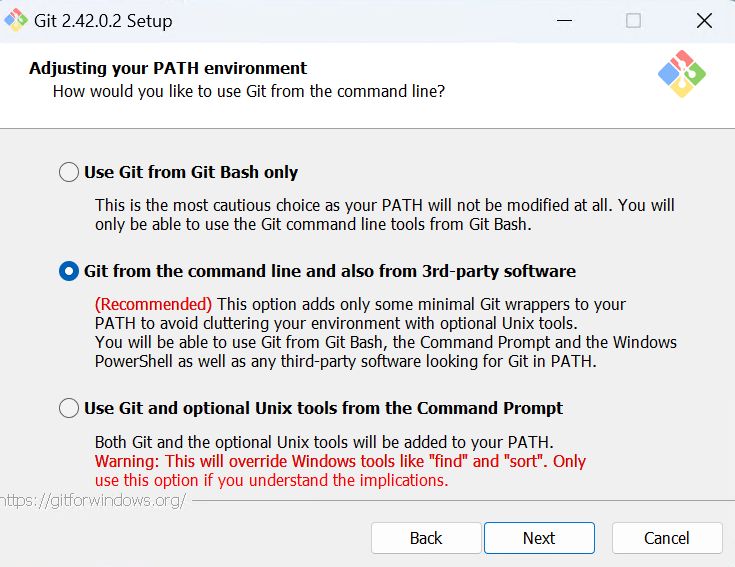

6. Utilizzare OpenSSL per l'encryption

   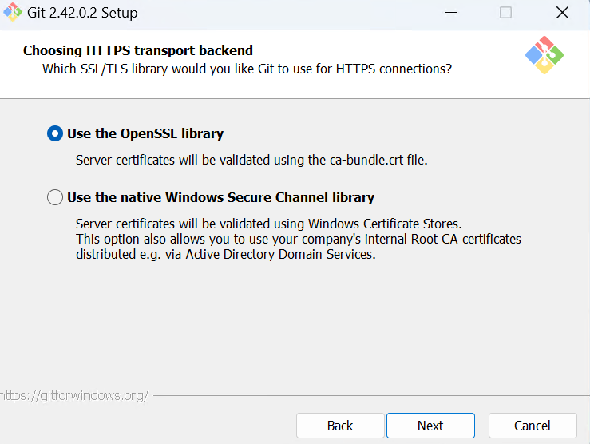

7. Impostare l'opzione core.autocrlf a true. Questa configurazione è quella raccomandata per utenti Windows che lavorano su progetti cross platform

   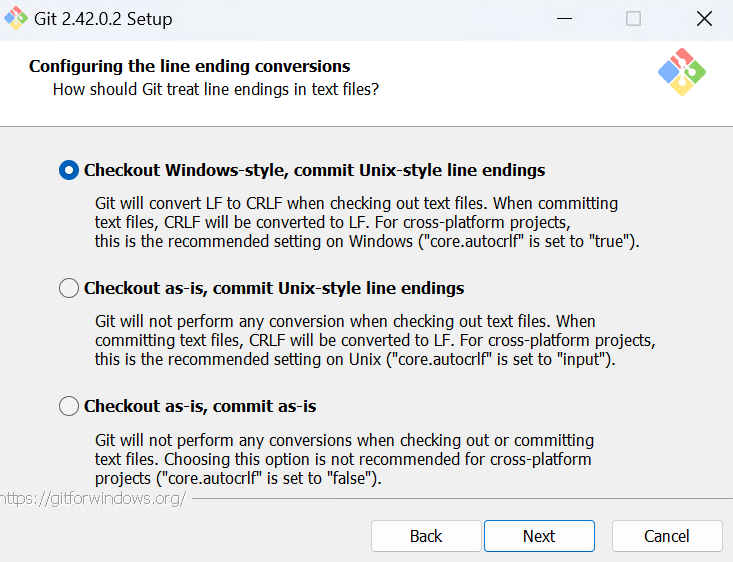

8. Usare MinTTY come emulatore di terminale per la Git Bash

    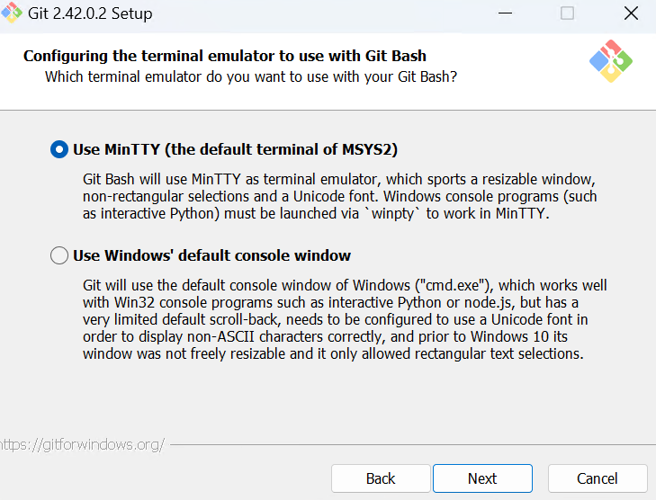

9. Lasciare come opzione di default del `git pull` il fast-forward o la merge

    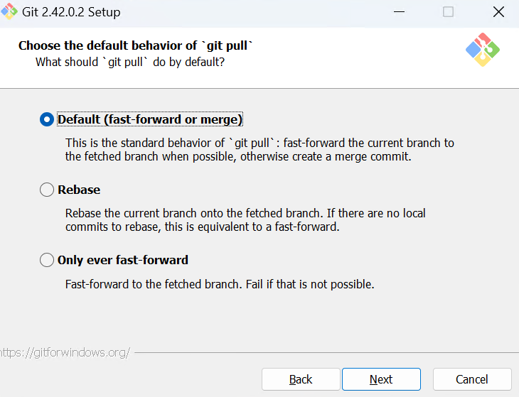

10. <mark>Importante!</mark> Utilizzare il cross platform Credential Manager per l'accesso autenticato ai repository remoti.  
Questa opzione permetterà di effettuare l'accesso remoto con il protocollo https e di memorizzare in maniera permanente le credenziali di accesso.

    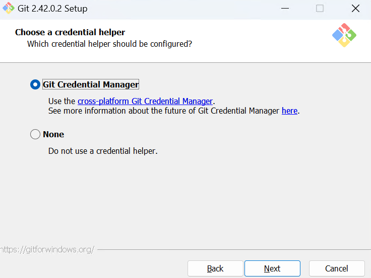

11. Abilitare il file system caching

    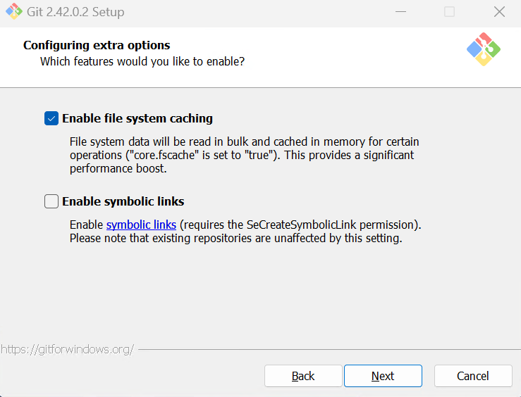

12. Procedere con l'installazione

    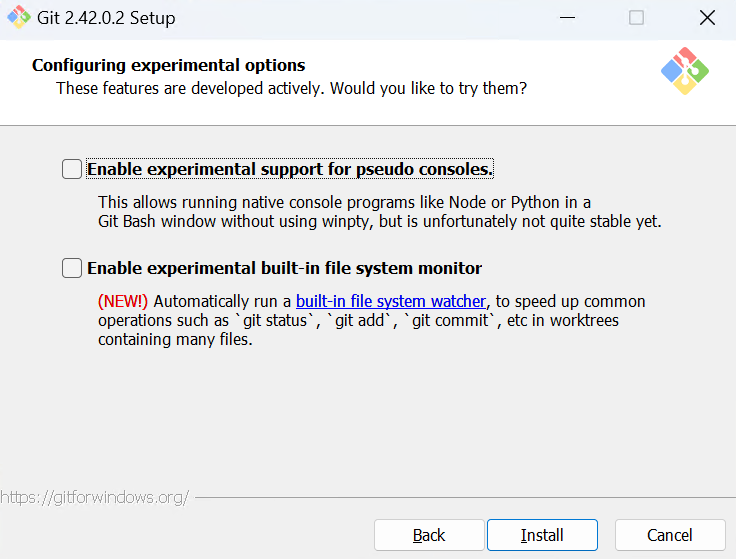

Dopo aver installato Git, chiudiamo il terminale e ne riapriamo un altro per fare in modo che il comando git sia riconosciuto nella shell.

Digitiamo il comando `git version` per conoscere la versione di Git installata

## Configurazione di Git

Per la configurazione di Git ci sono diverse guide, tra cui quelle riportate nei link seguenti:

<https://docs.github.com/en/get-started/quickstart/set-up-git>

<https://docs.github.com/en/get-started/getting-started-with-git/setting-your-username-in-git>

[<mark>https://git-scm.com/book/en/v2/Customizing-Git-Git-Configuration</mark>](https://git-scm.com/book/en/v2/Customizing-Git-Git-Configuration)

Apriamo la Git Bash, oppure Powershell e digitiamo il comando seguente per configurare il `nome utente`:

```sh
git config --global user.name "Mona Lisa"
```

Configuriamo la `e-mail` (la stessa usata per l'account di GitHub):

```sh
git config --global user.email "YOUR_EMAIL"
```

Per la scelta dell'indirizzo di posta elettronica da usare con GitHub ci sono diverse opzioni se si vuole tutelare la privacy del proprio indirizzo di posta. Gli aspetti più importanti sono riassunti nei link seguenti:

<https://docs.github.com/en/account-and-profile/setting-up-and-managing-your-personal-account-on-github/managing-email-preferences/setting-your-commit-email-address>

<https://docs.github.com/en/account-and-profile/setting-up-and-managing-your-personal-account-on-github/managing-email-preferences/setting-your-commit-email-address#setting-your-email-address-for-every-repository-on-your-computer>

Per le attività di laboratorio è sufficiente utilizzare la mail della scuola.

Il completamento della configurazione di Git verrà mostrato nella guida relativa all'utilizzo di Git.

## Installazione di Visual Studio

L'installazione di Visual Studio Community 2022 passa attraverso l'installazione dell'Installer di Visual Studio e poi attraverso la configurazione dei workload. L'installer è disponibile a questo indirizzo: <https://visualstudio.microsoft.com/it/vs/community/>  

Il workload richiesto per le attività di terza è .NET desktop development  

I workload necessari per le attività di quarta e quinta sono ASP.NET and web development e .NET Multi-Platform App UI development


