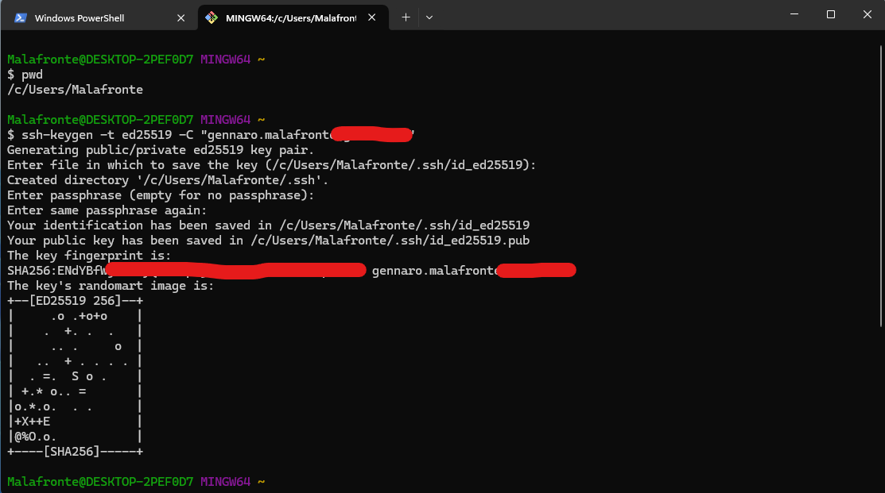
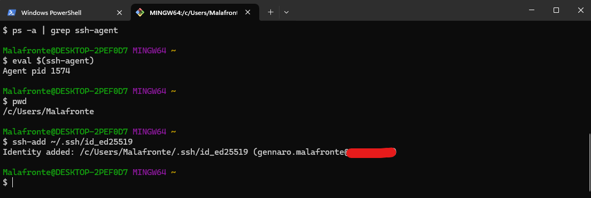
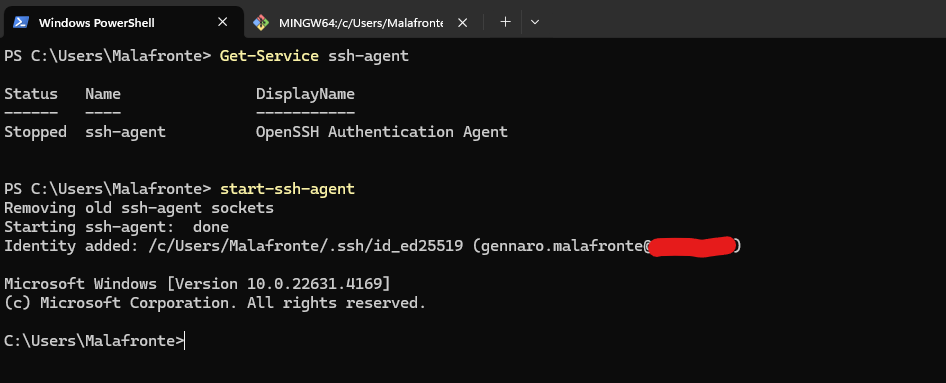
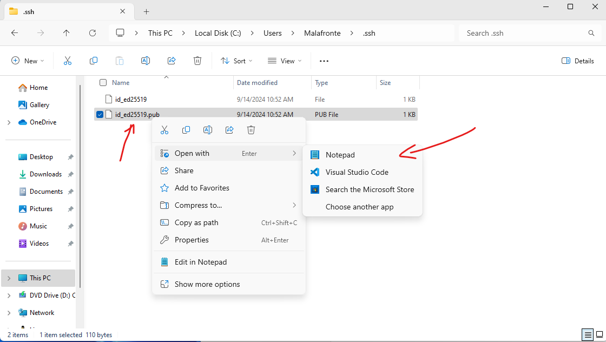

<style>p, li {text-align: justify}</style>

## Primi passi con Git

Per il corso di quarta occorre conoscere almeno i seguenti argomenti relativi a Git:

* Introducing Git (informazioni generali su Git)
* Learning Git (come installare Git)
* Git Basics (comandi di base di Git)  
* Committing in detail
* Git Branching
* Merging Branches
* Comparisons with Git Diff
* Git Stashing
* Undoing Stuff & Time Traveling
* Github Basics
* Fetching & Pulling
* Github Odds & Ends (repository pubblici e privati)
* Git workflow (for collaboration)
* Rebasing
* Git Tags

Per ciascuno di questi argomenti sono disponibli le slide net Team del corso.

In aggiunta alle slide del corso di Git ci sono molte altre risorse utili alla comprensione di Git e GitHub. In particolare:

* [GIT CHEAT SHEET](https://education.github.com/git-cheat-sheet-education.pdf) (un riassunto dei comandi principali di Git)
* [Getting started with Git](https://docs.github.com/en/get-started/getting-started-with-git). Guida focalizzata su:  
  * [setup iniziale di Git](https://docs.github.com/en/get-started/getting-started-with-git/setting-your-username-in-git)
  * [caching delle credenziali per connessioni https](https://docs.github.com/en/get-started/getting-started-with-git/caching-your-github-credentials-in-git)
  * [clonazione da remote](https://docs.github.com/en/get-started/getting-started-with-git/about-remote-repositories)
  * [gestione dei remote](https://docs.github.com/en/get-started/getting-started-with-git/managing-remote-repositories)
  * [associazione di un editor di testo a Git](https://docs.github.com/en/get-started/getting-started-with-git/associating-text-editors-with-git)
  * [configurazione dei line endings (terminatori di riga) per Git](https://docs.github.com/en/get-started/getting-started-with-git/configuring-git-to-handle-line-endings)
  >Nota: per questo argomento vedere anche quanto riportato in questa [discussione su StackOverflow](https://stackoverflow.com/questions/3206843/how-line-ending-conversions-work-with-git-core-autocrlf-between-different-operat).
  * [gestione del .gitignore file](https://docs.github.com/en/get-started/getting-started-with-git/ignoring-files)
  >Nota: per questo argomento vedere anche quanto riportato in questa [discussione su StackOverflow](https://stackoverflow.com/questions/1274057/how-do-i-make-git-forget-about-a-file-that-was-tracked-but-is-now-in-gitignore).
* [The Beginner’s Guide to Git & GitHub](https://docs.github.com/en/get-started/quickstart). Guida focalizzata principalmente sulle funzionalità di GitHub, e tra queste le più interessanti sono [Fork a repo](https://docs.github.com/en/get-started/quickstart/fork-a-repo), [GitHub flow](https://docs.github.com/en/get-started/quickstart/github-flow), [Contributing to projects](https://docs.github.com/en/get-started/quickstart/contributing-to-projects)
* [GitHub Docs](https://docs.github.com/en). La documentazione completa di GitHub.

## Connessione a GitHub

Esistono diversi modi per connettere un repository locale ad un remote su GitHub, in particolare:

* Connessione HTTPS
* Connessione SSH
* GitHub CLI (non trattata a lezione)

### Connessione a GitHub mediante SSH

Utilizzando il protocollo SSH è possibile connettersi e autenticarsi a server e servizi remoti. Con le chiavi SSH è possibile connettersi a GitHub senza fornire il proprio nome utente e il token di accesso personale ad ogni visita. È inoltre possibile utilizzare una chiave SSH per firmare le commit.  
Per effettuare una connessione autenticata SSH occorre, prima di tutto, creare una coppia di chiavi (pubblica e privata) SSH, come descritto nella guida [Generating a new SSH key and adding it to the ssh-agent](https://docs.github.com/en/authentication/connecting-to-github-with-ssh/generating-a-new-ssh-key-and-adding-it-to-the-ssh-agent); successivamente bisogna aggiungere la chiave pubblica al proprio profilo GitHub, come descritto nella guida [Adding a new SSH key to your GitHub account](https://docs.github.com/en/authentication/connecting-to-github-with-ssh/adding-a-new-ssh-key-to-your-github-account). Più nel dettaglio le procedure sono riportate di seguito con alcune variazioni rispetto alle guide ufficiali.

#### Generazione della coppia di chiavi

1. **<cite>Open Git Bash</cite>**  
2. **Paste the text below, replacing the email used in the example with your GitHub email address.**

    ```sh
    ssh-keygen -t ed25519 -C "nome.cognome@issgreppi.it"
    ```
  
    
  
    Quando si genera una coppia di chiavi SSH viene richiesta una password per proteggere l'utilizzo della chiave da persone non autorizzate, inoltre la password viene richiesta dall'agent la prima volta che viene aggiunta la chiave privata.
  
    La coppia di chiavi SSH è salvata in `C:/Users/username/.ssh/`

3. **<cite>Adding your SSH key to the ssh-agent</cite>**

    Si noti che la procedura descritta nella guida GitHub [Adding your SSH key to the ssh-agent](https://docs.github.com/en/authentication/connecting-to-github-with-ssh/generating-a-new-ssh-key-and-adding-it-to-the-ssh-agent#adding-your-ssh-key-to-the-ssh-agent) richiederebbe i permessi di admin <cite>"In a new admin elevated PowerShell window, ensure the ssh-agent is running..."</cite>, **ma è anche possibile aggiungere la propria chiave privata all'agent ssh, senza avere i privilegi di admin**.
  
    Ci sono almeno due modi per far partire l'ssh-agent e per aggiungere ad esso l'identità associata alla propria chiave privata, senza utilizzare i privilegi di admin:

      * **Primo modo**: nella Git bash (attraverso il pacchetto OpenSSH che viene distribuito con Git)
  
          Si fa partire l'ssh-agent con il comando

          ```sh
           eval $(ssh-agent)
          ```
  
          Si associa la chiave privata all'agent

          ```sh
           ssh-add ~/.ssh/id_ed25519
          ```
  
          
  
      * **Secondo modo** (alternativo al primo): nella PowerShell (oppure nel CMD), attraverso il pacchetto OpenSSH che è presente in Windows
        Si fa partire l'ssh-agent con il comando seguente che carica automaticamente la chiave privata in `C:/Users/username/.ssh/`

          ```ps1
           start-ssh-agent 
          ```

          

#### Aggiunta della propria chiave pubblica su GitHub

1. **<cite>Copy the SSH public key to your clipboard**<cite>
    Aprire la cartella `C:/Users/username/.ssh/` e con un editor di testo qualsiasi aprire il file corrispondente alla chiave pubblica creata (è il file con estensione .pub)
  
    
  
    Copiare tutto il contenuto del file (selezionare tutto il testo e coi copiarlo con CTRL+C)
  
2. **<cite>In the upper-right corner of any page on GitHub, click your profile photo, then click  Settings.</cite>**

3. **<cite>In the "Access" section of the sidebar, click  SSH and GPG keys.**<cite>

4. **<cite>Click New SSH key or Add SSH key.**<cite>

5. **<cite>In the "Title" field, add a descriptive label for the new key. For example, if you're using a personal laptop, you might call this key "Personal laptop".**<cite>

6. **<cite>Select the type of key, either authentication or signing. For more information about commit signing, see "About commit signature verification."**<cite>

7. **<cite>In the "Key" field, paste your public key.**<cite>

8. **<cite>Click Add SSH key.**<cite>

#### Test di connessione con la propria chiave SSH

Per effettuare il test della connessione a GitHub in SSH, si può provare a creare un nuovo repository localmente e poi a fare la push su GitHub, oppure se il repository locale esiste già, si può provare ad aggiungere il remote su GitHub e poi a fare la push.
**In ogni caso occorre creare prima un repository su GitHub e dargli un nome univoco, ad esempio, `repo_name` e poi collegare il repository locale ad esso**. Ad esempio, nel caso di connessione SSH, la procedura indicata da GitHub è:

**<cite>…or create a new repository on the command line</cite>**

```sh
  echo "# Just the repo title" >> README.md
  git init
  git add README.md
  git commit -m "first commit"
  git branch -M main
  git remote add origin git@github.com:github_username/repo_name.git
  git push -u origin main
```

**<cite>…or push an existing repository from the command line</cite>**

```sh
  git remote add origin git@github.com:github_username/repo_name.git
  git branch -M main
  git push -u origin main

```

<mark>Note:</mark>

   1. l'opzione `-M` serve a forzare il rename del branch corrente in `main`
   2. l'opzione `-u` serve per aggiungere lo <cite>upstream (tracking) reference, used by argument-less git-pull and other commands</cite>. In altri termini serve a definire il branch predefinito sul repository remoto, associato al branch locale quando si effettua la `git pull`, la `git push` e altri comandi. Una volta configurato il branch `main` con l'opzione `-u` sarà possibile effettuare una `git pull`, oppure una `git push` senza specificare l'endpoint remoto. Sarà sufficiente essere posizionati sul branch locale main.

La prima volta che ci si connette a GitHub, l'ssh agent chiede se ci si vuole davvero connettere a GitHub e se si vuole aggiungere l'host all'elenco degli host noti. In questo coso bisogna rispondere affermativamente. Il risultato di questa scelta è che l'ssh agent crea alcune righe nel file known_hosts (presente in `C:/Users/username/.ssh/`) con il dominio di GitHub e alcune informazioni estratte della chiave ssh utilizzata.  

In alcune situazioni si potrebbe riscontrare un problema con la connessione SSH, con un errore del tipo `ssh: Could not resolve hostname github.com`, come descritto in questa [discussione di StackOverflow](https://stackoverflow.com/a/9393431). In questo caso, la soluzione potrebbe essere riconducibile ad un problema di funzionamento del DNS locale. Per risolvere il problema in Windows si potrebbe ricorrere ad una pulizia della cache del DNS con `ipconfig /flushdns`, oppure, se ciò non risolve il problema, rivedere la configurazione del DNS per la propria macchina, eventualmente [impostando manualmente l'indirizzo IP del DNS server](https://www.windowscentral.com/how-change-your-pcs-dns-settings-windows-10).

Nel caso di connessione con il protocollo https la procedura di collegamento del repository locale al repository remoto su GitHub è uguale, con l'unica differenze che l'URI che identifica il repository remoto è scritto come:
`https://github.com/github_username/repo_name.git`
