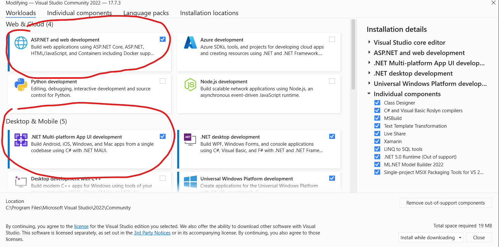

## Installazione di Visual Studio

L'installazione di Visual Studio Community 2022 passa attraverso l'installazione dell'Installer di Visual Studio e poi attraverso la configurazione dei workload. L'installer è disponibile a questo indirizzo: <https://visualstudio.microsoft.com/it/vs/community/>  

Il workload richiesto per le attività di terza è .NET desktop development  

I workload necessari per le attività di quarta e quinta sono ASP.NET and web development e .NET Multi-Platform App UI development

