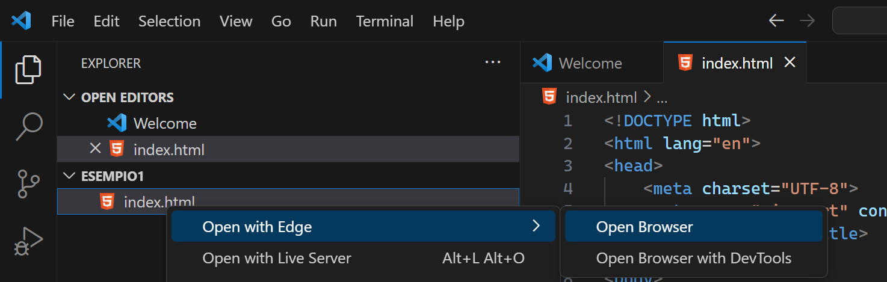

<style>p {text-align: justify}</style>

## Visual Studio Code

L'installazione di Visual Studio Code è già stata descritta su questo sito [qui]( "Installazione di Visual Studio Code"). In questa sezione si vedrà come configurarlo per lo sviluppo web con le tecnologie HTML, CSS e JavaScript.

## Primi passi con Visual Studio Code (VS Code)

Nel corso del programma di quarta l'utilizzo di VS Code è stato piuttosto limitato (utilizzato come semplice editor di testo, oppure come editor predefinito per Git). Nell'ambito del programma di quinta VS Code è usato in maniera molto più estesa poiché è uno strumento molto versatile e potente per lo sviluppo web. VS Code nasce come editor di testo che, grazie ad una miriade di plugin è in grado di diventare un potente IDE (Integrated Development Environment) per tantissimi linguaggi.  
In VS Code viene utilizzato il concetto di workspace al posto di quello di soluzione e di progetto, tipico di altri IDE, come ad esempio, Visual Studio 2022.  

La documentazione di VS Code è molto dettagliata ed estesa. Di seguito si riportano alcune pagine della documentazione particolarmente utili:

* [Introductory Videos](https://code.visualstudio.com/docs/getstarted/introvideos). Una serie di brevi video che spiegano come configurare velocemente VS Code per le attività più comuni
* [Tips and tricks](https://code.visualstudio.com/docs/getstarted/tips-and-tricks). Un elenco di suggerimenti e scorciatoie per adattare VS Code alle proprie esigenze.
* [Settings](https://code.visualstudio.com/docs/getstarted/settings). Impostazioni di VS Code
* [Workspace](https://code.visualstudio.com/docs/editor/workspaces). Concetto di VS Code Workspace
* [HTML](https://code.visualstudio.com/docs/languages/html). Supporto di HTML in VS Code

## Workspace[^1]

*A Visual Studio Code "workspace" is the collection of one or more folders that are opened in a VS Code window (instance). In most cases, you will have a single folder opened as the workspace but, depending on your development workflow, you can include more than one folder, using an advanced configuration called Multi-root workspaces.*

*The concept of a workspace enables VS Code to:*

* *Configure settings that only apply to a specific folder or folders but not others.*
* *Persist [task](https://code.visualstudio.com/docs/editor/tasks) and [debugger launch](https://code.visualstudio.com/docs/editor/debugging) configurations that are only valid in the context of that workspace.*
* *Store and restore UI state associated with that workspace (for example, the files that are opened).*
* *Selectively enable or disable extensions only for that workspace.*

*You may see the terms "folder" and "workspace" used interchangeably in VS Code documentation, issues, and community discussions. Think of a workspace as the root of a project that has extra VS Code knowledge and capabilities.*

> **Note:** *It is also possible to open VS Code without a workspace. For example, when you open a new VS Code window by selecting a file from your platform's **File** menu, you will not be inside a workspace. In this mode, some of VS Code's capabilities are reduced but you can still open text files and edit them.*

## How do I open a VS Code "workspace"?

*The easiest way to open a workspace is using the **File** menu and selecting one of the available folder entries for opening. Alternatively if you launch VS Code from a terminal, you can pass the path to a folder as the first argument to the `code` command for opening.*

## Single-folder workspaces

*You don't have to do anything for a folder to become a VS Code workspace other than open the folder with VS Code. Once a folder has been opened, VS Code will automatically keep track of things such as your open files and editor layout so the editor will be as you left it when you reopen that folder. You can also add other folder-specific configurations such as workspace-specific [settings](https://code.visualstudio.com/docs/getstarted/settings) (versus global user settings), [task definitions](https://code.visualstudio.com/docs/editor/tasks), and [debugging launch](https://code.visualstudio.com/docs/editor/debugging) files.*

## VS Code User Settings

*VS Code provides several different scopes for [settings](https://code.visualstudio.com/docs/getstarted/settings). When you open a workspace, you will see at least the following two scopes:  
User Settings - Settings that apply globally to any instance of VS Code you open.  
Workspace Settings - Settings stored inside your workspace and only apply when the workspace is opened.*

### User settings

La configurazione delle impostazioni (Settings) si può fare con:  
Settings Editor: **File** > **Preferences** > **Settings**, oppure con la scorciatoia (`Ctrl+,`).  
Aprendo direttamente il file `settings.json`:  **Command Palette** (`Ctrl+Shift+P`).

## Configurazione di Visual Studio Code per lo sviluppo web

VS Code fornisce già un supporto di base allo [sviluppo di pagine HTML](https://code.visualstudio.com/docs/languages/html) e al [debug nel browser](https://code.visualstudio.com/docs/nodejs/browser-debugging), tuttavia per avere un'esperienza di sviluppo più professionale conviene installare alcuni plugin.  
*Install an extension to add more functionality. Go to the **Extensions** view (Ctrl+Shift+X) and type `html` to see a list of relevant extensions to help with creating and editing HTML.:*  
In particolare è opportuno installare:  

* [HTML CSS Support](https://marketplace.visualstudio.com/items?itemName=ecmel.vscode-html-css)
* [IntelliSense for CSS class names in HTML](https://marketplace.visualstudio.com/items?itemName=Zignd.html-css-class-completion)
* [Microsoft Edge Tools for VS Code](https://marketplace.visualstudio.com/items?itemName=ms-edgedevtools.vscode-edge-devtools)  
  * [Documentazione di Microsoft Edge Tools for VS Code](https://learn.microsoft.com/en-us/microsoft-edge/devtools-guide-chromium/landing/)
* [Live Server](https://marketplace.visualstudio.com/items?itemName=ritwickdey.LiveServer)

## Installazione di Node.js

Sebbene non sia strettamente necessario, conviene installare anche Node.js per poter effettuare l'esecuzione e il debug del codice JavaScript direttamente il locale, senza doverlo necessariamente caricare nel browser.
L'installazione di Node.js si effettua facilmente scaricando l'installer dalla [pagina di download di Node.js](https://nodejs.org/en/download). L'integrazione di Node.js in VS Code è molto semplice, come mostrato nel [tutorial per Node.js di VS Code](https://code.visualstudio.com/docs/nodejs/nodejs-tutorial).

## Ciao Mondo! da una pagina web in VS Code

Si supponga di voler creare un progetto web (con HTML, CSS e JS) in una cartella chiamata esempio1. È possibile creare la cartella direttamente da VS Code, oppure crearla dalla console e poi richiamare VS Code come indicato negli [esempi di utilizzo di VS Code dalla command line](https://code.visualstudio.com/docs/getstarted/tips-and-tricks#_command-line) della documentazione.  


La cartella su cui è stsato aperto VS Code è il workspace corrente. 

### Creazione di un nuovo file

Per creare un file in VS Code ci sono diversi modi:  

* con la combinazione di tasti `Ctrl+n` (nuovo file), seguita dalla combinazione `Ctrl+s` (salva il file corrente)
* selezionando l'icona `new file` nel file explorer accanto alla cartella del workspace  
  

## Snippets in VS Code

Per scrivere il codice di una pagina HTML è possibile partire da uno [snippet](https://code.visualstudio.com/docs/editor/userdefinedsnippets) di pagina che corrisponde ad una sorta di modello di partenza che solleva lo sviluppatore dallo scrivere alcune parti di codice ripetitive. In realtà esistono snippets per diversi linguaggi e per attivarli in VS Code basta digitare `Crtl+space` e poi scrivere il tipo di snippet che si vuole richiamare. Nel caso di una pagina HTML per attivare lo snippet che crea il modello di pagina HTML si può digitare `Crtl+space` e poi digitare `HTML:5`, oppure iniziare a scrivere direttamente `html` e poi dovrebbero apparire automanticamente gli snippet relativi.  


Lo snippet relativo ad `HTML:5` produce come risultato il codice seguente:

```html
<!DOCTYPE html>
<html lang="en">
<head>
    <meta charset="UTF-8">
    <meta name="viewport" content="width=device-width, initial-scale=1.0">
    <title>Document</title>
</head>
<body>
    
</body>
</html>
```

## Emmet in Visual Studio Code[^2]

Emmet è uno strumento integrato nell'editor di VS Code che semplifica e velocizza di molto la digitazione del codice.  

*Support for [Emmet](https://emmet.io/) snippets and expansion is built right into Visual Studio Code, **no extension required**. [Emmet 2.0](https://code.visualstudio.com/blogs/2017/08/07/emmet-2.0) has support for the majority of the [Emmet Actions](https://docs.emmet.io/actions/) including expanding [Emmet abbreviations and snippets](https://docs.emmet.io/cheat-sheet/).*

### How to expand Emmet abbreviations and snippets

*Emmet abbreviation and snippet expansions are enabled by default in `html`, `haml`, `pug`, `slim`, `jsx`, `xml`, `xsl`, `css`, `scss`, `sass`, `less` and `stylus` files, as well as any language that inherits from any of the above like `handlebars` and `php`.*

*When you start typing an Emmet abbreviation, you will see the abbreviation displayed in the suggestion list. If you have the suggestion documentation fly-out open, you will see a preview of the expansion as you type. If you are in a stylesheet file, the expanded abbreviation shows up in the suggestion list sorted among the other CSS suggestions.*

## Utilizzo di Live Server

[Live Server](https://marketplace.visualstudio.com/items?itemName=ritwickdey.LiveServer) è un lpugin di VS Code che permette di avere un server HTTP direttamente all'interno di VS Code e di lanciare nel browser le pagine HTML di cui si vuole vedere la preview. Live Server permette di vedere il risultato delle modifiche del codice in tempo reale quando è abbinato alla funzione `auto save` di VS Code.  


## Utilizzo di Microsoft Edge Tools for VS Code

[Microsoft Edge Tools](https://learn.microsoft.com/en-us/microsoft-edge/devtools-guide-chromium/landing/) permette di avviare i Developer Tools di Microsoft Edge direttamente dentro Visual Studio Code.  



## Browser debugging in VS Code

Visual Studio Code supporta il [debug](https://code.visualstudio.com/docs/editor/debugging) per moltissimi linguaggi di programmazione. Per il debug del codice JavaScript si può vedere la sezione [debugging](https://code.visualstudio.com/Docs/languages/javascript#_debugging) nella documentazione relativa alla [programmazione in JavaScript](https://code.visualstudio.com/Docs/languages/javascript), oppure, per il debug del codice eseguito nel browser, vedere la documentazione relativa a [Browser debugging in VS Code](https://code.visualstudio.com/docs/nodejs/browser-debugging).  
Per il debug del codice Javascript nel browser, basta aprire la sezione Debug e cliccare sul pulsante Debug. Si apre un menu che permette di scegliere il tipo di debug che si vuole eseguire.  

  

Ad esempio per eseguire il debug con Chrome, basta selezionare la voce `Web App (Chrome)`.  


[^1]: [Workspaces](https://code.visualstudio.com/docs/editor/workspaces)
[^2]: [Emmet in Visual Studio Code](https://code.visualstudio.com/docs/editor/emmet)
