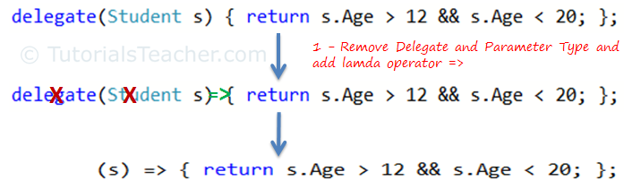
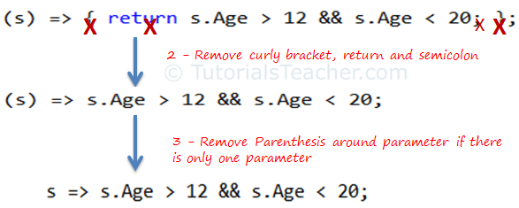
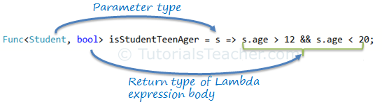

Sometimes the whole signature of a method can be more code than the body
of a method. There are also situations in which you need to create an
entire method only to use it in a delegate.

For these cases, Microsoft added some new features to C#, 2.0 anonymous
methods were added. In C# 3.0, things became even better when lambda
expressions were added. Lambda expression is the preferred way to go
when writing new code.

<!--more-->

<https://www.tutorialsteacher.com/linq/linq-lambda-expression>

<https://kudchikarsk.com/delegates-and-events-in-csharp/#lambda-expressions-in-csharp>

Below is an example of newer lambda syntax.

```cs

class Program

{
    public delegate double MathDelegate(double value1, double value2);
    public static void Main()
    {
        MathDelegate mathDelegate = (x, y) => x + y;
        var result = mathDelegate(5, 2);
        Console.WriteLine(result);
        // output: 7
        mathDelegate = (x, y) => x - y;
        result = mathDelegate(5, 2);
        Console.WriteLine(result);
        // output: 3
        Console.ReadLine();
    }
}
```

When reading this code, you can say go or goes to for the special lambda
syntax. For example, the first lambda expression in the above example is
read as "x and y goes to adding x and y".

The lambda function has no specific name as the methods. Because of
this, lambda functions are called anonymous functions. You also don't
have to specify a return type explicitly. The compiler infers this
automatically from your lambda. And in the case of the above example,
the types of parameters x and y are also not specified explicitly.

You can create lambdas that span multiple statements. You can do this by
adding curly braces around the statements that form the lambda as below
example shows.

```cs

MathDelegate mathDelegate = (x, y) =>
{
    Console.WriteLine("Add");
    return x + y;
};

```

You can learn more about .NET built-in delegates
[here](https://www.c-sharpcorner.com/blogs/c-sharp-generic-delegates-func-action-and-predicate).

## Lambda examples

<https://www.tutorialsteacher.com/linq/linq-lambda-expression>

Si riportano di seguito alcuni esempi che spiegano il passaggio da
funzione anonima a lambda expression

Si consideri il seguente esempio di delegato con funzione anonima:

```cs

namespace ArgomentiAvanzati

{
    public class Program
    {
        delegate bool IsTeenAger(Student stud);
        public static void Main()
        {
            IsTeenAger isTeenAger = delegate (Student s) { return s.Age > 12 &&
            s.Age < 20;};
            Student stud = new Student() { Age = 25 };
            Console.WriteLine(isTeenAger(stud));
            Console.ReadLine();
        }
    }

    public class Student
    {
        public int Id { get; set; }
        public string Name { get; set; }
        public int Age { get; set; }
    }
}
```

Lo stesso risultato si può ottenere con il seguente costrutto lambda

```cs

namespace ArgomentiAvanzati
{
    public class Program
    {
        delegate bool IsTeenAger(Student stud);
        public static void Main()
        {
            IsTeenAger isTeenAger = s => s.Age > 12 && s.Age < 20;
            Student stud = new Student() { Age = 25 };
            Console.WriteLine(isTeenAger(stud));
            Console.ReadLine();
        }
    }
        public class Student
    {
        public int Id { get; set; }
        public string Name { get; set; }
        public int Age { get; set; }
    }
}
```

Spiegazione:

The Lambda expression evolves from anonymous method by first removing
the delegate keyword and parameter type and adding a lambda operator
=\>.



Lambda Expression from Anonymous Method

The above lambda expression is absolutely valid, but we don\'t need the
curly braces, return and semicolon if we have only one statement that
returns a value. So we can eliminate it.

Also, we can remove parenthesis (), if we have only one parameter.



Lambda Expression from Anonymous Method

Thus, we got the lambda expression: s =\> s.Age \> 12 && s.Age \<
20 where **s** is a parameter, **=\>** is the lambda operator
and **s.Age \> 12 && s.Age \< 20** is the body expression:


Lambda Expression Structure in C#

You can wrap the parameters in parenthesis if you need to pass more than
one parameter, as below:

```cs
namespace ArgomentiAvanzati

{
    public class Program

    {

        delegate bool IsYoungerThan(Student stud, int youngAge);
        public static void Main()
        {
            IsYoungerThan isYoungerThan = (s, youngAge) => s.Age < youngAge;
            Student stud = new Student() { Age = 25 };
            Console.WriteLine(isYoungerThan(stud, 26));
            Console.ReadLine();
        }

    }

    public class Student

    {
        public int Id { get; set; }
        public string Name { get; set; }
        public int Age { get; set; }
    }

}
```

You can also give type of each parameters if parameters are confusing:

```cs
(Student s,int youngAge) => s.Age >= youngage;
```

It is not necessary to have at least one parameter in a lambda
expression. The lambda expression can be specify without any parameter
also.

```cs

() => Console.WriteLine("Parameter less lambda expression")
```

Ad esempio:

```cs

namespace ArgomentiAvanzati
{
    public class Program
    {
        delegate void Print();
        public static void Main()
        {
            Print print = () => Console.WriteLine("This is parameter less lambda expression");
            print();
            Console.ReadLine();
        }
    }
}
```

You can wrap expressions in curly braces if you want to have more than
one statement in the body:

```cs

(s, youngAge) =>
{
    Console.WriteLine("Lambda expression with multiple statements in the body");
    return s.Age >= youngAge;
}

Ad esempio:

```cs

namespace ArgomentiAvanzati
{
    public class Student

    {
        public int Id { get; set; }
        public string Name { get; set; }
        public int Age { get; set; }
    }

    public class Program
    {
        delegate bool IsYoungerThan(Student stud, int youngAge);
        public static void Main()
        {
            IsYoungerThan isYoungerThan = (s, youngAge) => 
            {
                Console.WriteLine("Lambda expression with multiple statements in the body");
                return s.Age < youngAge;

            };
        Student stud = new Student() { Age = 25 };
        Console.WriteLine(isYoungerThan(stud, 26));
        Console.ReadLine();
        }                           
    }
}
```

You can declare a variable in the expression body to use it anywhere in
the expression body, as below:

```cs
namespace ArgomentiAvanzati
{
    public class Program
    {
        delegate bool IsAdult(Student stud);
        public static void Main()
        {
            IsAdult isAdult = (s) => 
            {
                int adultAge = 18;
                Console.WriteLine("Lambda expression with multiple statements in the body");
                return s.Age >= adultAge;
            };
            Student stud = new Student() { Age = 25 };
            Console.WriteLine(isAdult(stud));
            Console.ReadLine();
        }
    }

    public class Student

    {
        public int Id { get; set; }
        public string Name { get; set; }
        public int Age { get; set; }
    }

}
```

### Function Delegate and its use with lambda

The .NET Framework has a couple of built-in delegates types that you can
use when declaring delegates.

For the MathDelegate examples, you have used the following delegate:

public delegate double MathDelegate(double value1, double value2);

You can replace this delegate with one of the built-in types namely
Func\<int, int, int\>.

like this,

```cs

class Program

{
    public static void Main()
    {
        //modalità alternativa per definire un delegato
        Func<int, int, int> mathDelegate = (x, y) =>
        {
            Console.WriteLine("Add");
            return x + y;
        };
        var result = mathDelegate(5, 2);
        Console.WriteLine(result);
        // output: 7
        mathDelegate = (x, y) => x - y; ;
        result = mathDelegate(5, 2);
        Console.WriteLine(result);
        // output: 3
        Console.ReadLine();
    }
}
```

The Func\<\...\> types can be found in the System namespace and they
represent delegates that return a type and take 0 to 16 parameters. All
those types inherit from System.MulticaseDelegate so you can add
multiple methods to the invocation list.

The lambda expression can be assigned to Func\<in T, out TResult\> type
delegate. The last parameter type in a Func delegate is the return type
and rest are input parameters. Visit [Func
delegate](https://www.tutorialsteacher.com/csharp/csharp-func-delegate)
section of C# tutorials to know more about it.

Consider the following lambda expression to find out whether a student
is a teenager or not.

```cs

Func<Student, bool> isStudentTeenAger = s => s.Age > 12 && s.Age <20;
Student std = new Student() { age = 21 };
bool isTeen = isStudentTeenAger(std);// returns false
```

In the above example, the Func delegate expects the first input
parameter to be of Student type and the return type to be boolean. The
lambda expression s =\> s.age \> 12 && s.age \< 20 satisfies the
Func\<Student, bool\> delegate requirement, as shown below:



Func delegate with Lambda Expression

The Func\<\> delegate shown above, would turn out to be a function as
shown below.

```cs

bool isStudentTeenAger(Student s)
{
    return s.Age > 12 && s.Age < 20;
}
```

### Action Delegate and its use with lambda

Unlike the Func delegate, an Action delegate can only have input
parameters. Use the [Action
delegate](https://www.tutorialsteacher.com/csharp/csharp-action-delegate)
type when you don\'t need to return any value from lambda expression.

If you want a delegate type that doesn't return a value, you can use the
System.Action types. They can also take 0 to 16 parameters, but they
don't return a value.

Here is an example of using the Action type

```cs

class Program
{
    public static void Main()
    {
        Action<int, int> mathDelegate = (x, y) =>
        {
            Console.WriteLine(x + y);
        };
        mathDelegate(5, 2);
        // output: 7
        mathDelegate = (x, y) => Console.WriteLine(x - y);
        mathDelegate(5, 2);
        // output: 3
        Console.ReadLine();
    }
}
```

Esempio con le lambda expressions:

```cs

namespace ArgomentiAvanzati

{
    public class Program
    {
        public static void Main()
        {
        Action<Student> PrintStudentDetail = s => Console.WriteLine("Name:{0}, Age: {1}", s.Name, s.Age");
        Student std = new Student() { Name = "Bill", Age = 21 };
        PrintStudentDetail(std);
        Console.ReadLine();
        }
    }

    public class Student
    {
    public int Id { get; set; }
    public string Name { get; set; }
    public int Age { get; set; }
    }
}
```

Things start to become more complex when your lambda function starts
referring to variables declared outside of the lambda expression or to
this reference. Normally when control leaves the scope of the variable,
the variable is no longer valid. But what if a delegate refers to a
local variable. To fix this, the compiler generates code that makes the
life of the captured variable at least as long as the longest-living
delegate. This is called a closure.

You can learn more about
closure [here](https://web.archive.org/web/20150707082707/http:/diditwith.net/PermaLink,guid,235646ae-3476-4893-899d-105e4d48c25b.aspx).

## What\'s a Closure?

A closure is a function that is bound to the environment in which it is
declared. Thus, the function can reference elements from the environment
within it\'s body. In the case of a C# 2.0 anonymous method, the
environment to which it is bound is its parenting method body. This
means that local variables from the parenting method body can be
referenced within the anonymous method\'s body. So, this code prints 0
to the console as expected:

```cs
class Program
{
    delegate void MyAction();
    static void Main(string[] args)
    {
    int x = 0;
    MyAction a = delegate { Console.WriteLine(x); };
    a();
    Console.ReadLine();
    }
}
```

Most developers don\'t have any problem with the code above. A local
variable \"x\" is declared and initialized to 0. Then, a new delegate
\"a\" of type Action is declared and assigned to an anonymous method
that writes \"x\" to the console. Finally, \"a\" is called and the value
of \"x\" (0) is printed to the console. The rub occurs when the code is
changed like this:

```cs
class Program
{
    delegate void MyAction();
    static void Main(string[] args)
    {
        int x = 0;
        MyAction a = delegate { Console.WriteLine(x); };
        x = 1;
        a();
        Console.ReadLine();
    }
}
```

Now, \"x\" is reassigned to a value of 1 before \"a\" is called. What
will be output to the console?

It turns out that the answer is 1, not 0. The reason for this is that
the anonymous method is a closure and is bound to its parenting method
body and the local variables in it. The important distinction is that it
is bound to variables, not to values. In other words, the value of \"x\"
is not copied in when \"a\" is declared. Instead, a reference to \"x\"
is used so that \"a\" will always use the most recent value of \"x\". In
fact, this reference to \"x\" will be persisted even if \"x\" goes out
of scope. Consider this code:

```cs

class Program
{
delegate void MyAction();
static MyAction GetAction()
{
int x = 0;
MyAction a = delegate { Console.WriteLine(x); };
x = 1;
return a;
}

static void Main(string[] args)
{
MyAction a = GetAction();
a();
Console.ReadLine();
}
}
```

That will still print 1 to the console even though \"x\" is out of scope
by the time that \"a\" is called. So, how is this achieved? Well, the
good news is that this is handled through compiler magic. There isn\'t
any runtime support for closures. That means that you could use the same
techniques to create a closure without using an anonymous method.

## Points to Remember

1. Lambda Expression is a shorter way of representing anonymous method.

2. Lambda Expression syntax: *parameters =\> body expression*

3. Lambda Expression can have zero parameter.

4. Lambda Expression can have multiple parameters in parenthesis ().

5. Lambda Expression can have multiple statements in body expression in
    curly brackets {}.

6. Lambda Expression can be assigned to Func, Action or Predicate
    delegate.

7. Lambda Expression can be invoked in a similar way to delegate.
